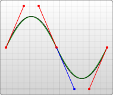
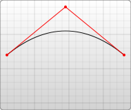

# 定义

贝塞尔曲线（读作 [bezje]）是一种使用数学方法描述的曲线，被广泛用于计算机图形学和动画中。在矢量图中，贝塞尔曲线用于定义可无限放大的光滑曲线。

## 构造解析

贝塞尔曲线构造过程解析下面我们就简单的来解析一下一个二次贝塞尔曲线，请看下面的解析图：


上图中的红色曲线正是一条贝塞尔曲线，而图中的 P0、P1、P2 分别称之为控制点，贝塞尔曲线的产生完全与这三个点位置相关。这三个控制点就分别构成了两条灰色的线 P0P1 和 P1P2。现在我们从两条线上各选取一个点即 Q0、Q1。Q0、Q1 需要满足以下的公式：


接着我们再将 Q0、Q1 相连，就能得到上图中的绿色线 Q0Q1，在这条线上我们再取一个点 B，点 B 也要满足上述规律：


令上述等式等于 t，t 肯定是 [0,1] 的，其意义是点在它所处线段的位置。那么随着 t 的增大，Q0、Q1、B 的位置也就随之确定了！最终 B 的轨迹，便构成了贝塞尔曲线。


上面分析的是二次贝塞尔曲线，仔细观察它的构造过程，我们不难发现其存在递归性质。首先，有三个控制点；三个控制点形成两个线段，每个线段上有一个点在运动，于是得到两个点；两个点形成一个线段，这个线段上有一个点在运动，于是得到一个点；最后一个点的运动轨迹便构成了贝塞尔曲线！我们发现，实际上是每轮都是 n 个点，形成 n-1 条线段，每个线段上有一个点在运动，那么就只关注这 n-1 个点，循环往复。最终只剩一个点时，它的轨迹便是结果。那么，似乎最开始的控制点，也不一定是三个？如果是四个、五个，甚至更多呢？当然是有的，其实我们一开始介绍的有三个控制点的就是二次贝塞尔曲线（要递归两次），而四个、五个控制点的就是三次、四次贝塞尔曲线。

三次贝塞尔曲线


四次贝塞尔曲线


> https://juejin.cn/post/7352075813259198514

---

贝塞尔曲线的生成由两部分决定：

**锚点：起点，终点 (一些说法会将锚点一同归为控制点，本文使用分开的方式)**

控制点

---

贝塞尔曲线由至少两个控制点进行描述。Web 技术中使用的是三次贝塞尔曲线，即使用四个控制点 P0、P1、P2 和 P3 描述的曲线。

在绘制二次贝塞尔曲线的过程中，需要先作两条辅助线：P0 到 P1 和 P1 到 P2；第三条辅助线从其起点稳步移动到第一辅助线上，终点在第二辅助线上。在这条辅助线上，有一个点从其起点稳步移动到其终点。这个点描述的曲线就是贝塞尔曲线。以下是一个动画示例，展示了曲线的创建过程：

### 二次贝塞尔曲线


二次贝塞尔曲线是使用三个点定义的平滑曲线：

- 起始点 $(Po=\{xo, yo\})$
- 终点 $(Pn=\{xn, yn\})$
- 控制点 $(Pc=\{xc, yc\})$

| 命令 | 参数                 | 注释                                                                                                                                                  |
| ---- | -------------------- | ----------------------------------------------------------------------------------------------------------------------------------------------------- |
| Q    | $(x1, y1, x, y)$     | 在当前位置和终点 $(x, y)$ 之间绘制一条二次贝塞尔曲线。 $Pn=\{x, y\}$, $Pc=\{x1, y1\}$                                                                 |
| q    | $(dx1, dy1, dx, dy)$ | 在当前位置和终点（终点为当前位置沿 x 轴偏移 $dx$ 以及沿 y 轴偏移 $dy$ 处）之间绘制一条二次贝塞尔曲线。 $Pn=\{xo+dx, yo+dy\}$, $Pc=\{xo+dx1, yo+dy1\}$ |
| T    | $(x, y)$             | 在当前位置和终点 $(x, y)$ 之间绘制一条平滑的二次贝塞尔曲线。 $Pn=\{x, y\}$                                                                            |
| t    | $(dx, dy)$           | 在当前位置和终点（终点为当前位置沿 x 轴偏移 $dx$ 以及沿 y 轴偏移 $dy$ 处）之间绘制一条平滑的二次贝塞尔曲线。 $Pn=\{xo+dx, yo+dy\}$                    |

### 三次贝塞尔曲线是使用四个点定义的平滑曲线:


- 起始点 $(Po=\{xo, yo\})$
- 终点 $(Pn=\{xn,yn\})$
- 起始控制点 $(Pcs=\{xcs, ycs\})$
- 终点控制点 $(Pce=\{xce, yce\})$

| 命令 | 参数 | 注释 |
| --- | --- | --- |
| C | $(x1, y1, x2, y2, x, y)$ | 在当前位置和终点 $(x, y)$ 之间绘制一条三次贝塞尔曲线。 $Pn=\{x, y\}$, Pcs= $\{x1, y1\}$, Pce= $\{x2, y2\}$ |
| C | $(dx1, dy1, dx2, dy2, dx, dy)$ | 在当前位置和终点（终点为当前位置沿 x 轴偏移 dx 以及沿 y 轴偏移 dy 处）之间绘制一条三次贝塞尔曲线。 $Pn=\{xo+dx, yo+dy\}$, Pcs= $\{xo+dx1, yo+dy1\}$, Pce= $\{xo+dx2, yo+dy2\}$ |
| S | $(x2, y2, x, y)$ | 在当前位置和终点 $(x, y)$ 之间绘制一条平滑的三次贝塞尔曲线。 |
| S | $(dx2, dy2, dx, dy)$ | 在当前位置和终点（终点为当前位置沿 x 轴偏移 dx 以及沿 y 轴偏移 dy 处）之间绘制一条平滑的三次贝塞尔曲线。 |

## 前置命令

| 命令 | 名称                                                   | 参数                                                   |
| ---- | ------------------------------------------------------ | ------------------------------------------------------ |
| M    | moveto / 移动到                                        | (x y)+                                                 |
| Z    | closepath / 关闭路径                                   | (none)                                                 |
| L    | lineto / 画线到                                        | (x y)+                                                 |
| H    | horizontal lineto / 水平线到                           | X+                                                     |
| V    | vertical lineto / 垂直线到                             | y+                                                     |
| C    | curveto / 三次贝塞尔曲线到                             | (x1 y1 x2 y2 × y)+                                     |
| S    | smooth curveto / 光滑三次贝塞尔曲线到                  | (x2 y2 × y)+                                           |
| Q    | quadratic Bézier curveto / 二次贝塞尔曲线到            | (x1 y1 × y)+                                           |
| T    | smooth quadratic Bézier curveto / 光滑二次贝塞尔曲线到 | (x y)+                                                 |
| A    | elliptical arc / 椭圆弧                                | (rx ry x-axis-rotation large-arc-flag sweep-flag x y)+ |
| R    | Catmull-Rom curveto\* / Catmull-Rom 曲线               | x1 y1 (x y)+                                           |

## path 中的贝塞尔曲线

贝塞尔曲线的类型有很多，但是在 path 元素里，只存在两种贝塞尔曲线：三次贝塞尔曲线 C，和二次贝塞尔曲线 Q。

## C 三次曲线

最后一个坐标 (x,y) 表示的是曲线的终点，另外两个坐标是控制点，(x1,y1) 是起点的控制点，(x2,y2) 是终点的控制点。如果你熟悉代数或者微积分的话，会更容易理解控制点，控制点描述的是曲线起始点的斜率，曲线上各个点的斜率，是从起点斜率到终点斜率的渐变过程

```
C x1 y1, x2 y2, x y
(or)
c dx1 dy1, dx2 dy2, dx dy
```

实例： 

<svg width="190" height="160" xmlns="http://www.w3.org/2000/svg">
  <path d="M 10 10 C 20 20, 40 20, 50 10" stroke="black" fill="transparent"/>
  <path d="M 70 10 C 70 20, 110 20, 110 10" stroke="black" fill="transparent"/>
  <path d="M 130 10 C 120 20, 180 20, 170 10" stroke="black" fill="transparent"/>
  <path d="M 10 60 C 20 80, 40 80, 50 60" stroke="black" fill="transparent"/>
  <path d="M 70 60 C 70 80, 110 80, 110 60" stroke="black" fill="transparent"/>
  <path d="M 130 60 C 120 80, 180 80, 170 60" stroke="black" fill="transparent"/>
  <path d="M 10 110 C 20 140, 40 140, 50 110" stroke="black" fill="transparent"/>
  <path d="M 70 110 C 70 140, 110 140, 110 110" stroke="black" fill="transparent"/>
  <path d="M 130 110 C 120 140, 180 140, 170 110" stroke="black" fill="transparent"/>
</svg>

上面的例子里，创建了 9 个三次贝塞尔曲线。有一点比较遗憾，标记控制点的代码会比较庞大，所以在这里舍弃了。（之前所有点都用 circle 标记，此处一样，只不过没把代码列出来）。如果你想更准确地控制它们，可以自己动手把他们画出来。图例上的曲线从左往右看，控制点在水平方向上逐渐分开，图例上的曲线从上往下看，控制点和曲线坐标之间离得越来越远。这里要注意观察，曲线沿着起点到第一控制点的方向伸出，逐渐弯曲，然后沿着第二控制点到终点的方向结束。

你可以将若干个贝塞尔曲线连起来，从而创建出一条很长的平滑曲线。通常情况下，一个点某一侧的控制点是它另一侧的控制点的对称（以保持斜率不变）。这样，你可以使用一个简写的贝塞尔曲线命令 S，如下所示：

```
S x2 y2, x y
(or)
s dx2 dy2, dx dy
```

```
d="C x1,y1 x2,y2 x,y" // 控制点1 (x1,y1)，控制点2 (x2,y2)，终点 (x,y)
d="S x2,y2 x,y" 			// S只要控制点2就可以了
```

### C+S

S 命令可以用来创建与前面一样的贝塞尔曲线，但是，如果 S 命令跟在一个 C 或 S 命令后面，则它的第一个控制点会被假设成前一个命令曲线的第二个控制点的中心对称点。如果 S 命令单独使用，前面没有 C 或 S 命令，那当前点将作为第一个控制点。下面是 S 命令的语法示例，图中左侧红色标记的点对应的控制点即为蓝色标记点。



<svg width="190" height="160" xmlns="http://www.w3.org/2000/svg">
  <path d="M 10 80 C 40 10, 65 10, 95 80 S 150 150, 180 80" stroke="black" fill="transparent"/>
</svg>

## Q 二次曲线

path 中另一种可用的贝塞尔曲线是二次贝塞尔曲线 Q，它比三次贝塞尔曲线简单，只需要一个控制点，用来确定起点和终点的曲线斜率。因此它需要两组参数，控制点和终点坐标。

```
Q x1 y1, x y
(or)
q dx1 dy1, dx dy
```

 SVG 中 Q 的点格式

 <svg width="300" height="250">
      <path
        d="M10 80,L10 65, Q10 60 15 60, L90 60,Q95 60 95 55,L95 35"
        fill="none"
        stroke="black"
        stroke-width="2"
      />
</svg>

<svg width="190" height="160" xmlns="http://www.w3.org/2000/svg">
  <path d="M 10 80 Q 95 10 180 80" stroke="black" fill="transparent"/>
</svg>

- Q + T

T 圆滑连接到指定点二次贝塞尔曲线有一个差不多的 T 命令，可以通过更简短的参数，延长二次贝塞尔曲线。

```
T x y
(or)
t dx dy
```

和之前一样，快捷命令 **T 会通过前一个控制点，推断出一个新的控制点**。这意味着，在你的第一个控制点后面，可以只定义终点，就创建出一个相当复杂的曲线。需要注意的是，T 命令前面必须是一个 Q 命令，或者是另一个 T 命令，才能达到这种效果。如果 T 单独使用，那么控制点就会被认为和终点是同一个点，所以画出来的将是一条直线。


<svg width="190" height="160" xmlns="http://www.w3.org/2000/svg"> <path d="M 10 80 Q 52.5 10, 95 80 T 180 80" stroke="black" fill="transparent"/> </svg>

虽然三次贝塞尔曲线拥有更大的自由度，但是两种曲线能达到的效果总是差不多的。具体使用哪种曲线，通常取决于需求，以及对曲线对称性的依赖程度。

---


有 T： <svg width="200" height="200"> <path 
          d="M0,200  Q0,0 100,100 T200,0"
          stroke="#4CAF50" 
          fill="none" 
          stroke-width="2" 
        /> </svg>

没 T： <svg width="200" height="200"> <path 
          d="M0,200  Q0,0 100,100 L200,0"
          stroke="#4CAF50" 
          fill="none" 
          stroke-width="2" 
        /> </svg>

[svg 中 path 贝塞尔曲线和圆弧图文详解](https://juejin.cn/post/7018952717343129607)

### Canvas 中

Canvas 提供了 bezierCurveTo() 方法来绘制三阶贝塞尔曲线。

ctx.bezierCurveTo(cp1x, cp1y, cp2x, cp2y, x, y); bezierCurveTo 接受 6 个参数，依次为三阶贝塞尔曲线的 控制点 1、控制点 2、终点的 x 和 y 坐标。

诶，这个起点坐标哪去了？

其实起点在 画笔当前所停留的位置。这个位置可能是上次通过 moveTo() 到达的一个位置，也可能是上个贝塞尔曲线绘制后所抵达的终点坐标。

这里写个绘制三阶贝塞尔曲线的示例代码：

```javaScript
const canvas = document.querySelector('canvas');
const ctx = canvas.getContext('2d');

ctx.translate(100, 40);

const p1 = [0, 80]; // 起点
const p2 = [200, 80]; // 终点
const cp1 = [-10, 0] // 控制点 1
const cp2 = [110, 0] // 控制点 2

// 设置线条样式
ctx.strokeStyle = 'red';
ctx.lineWidth = 2;

ctx.beginPath();
// 绘制贝塞尔曲线
ctx.moveTo(p1[0], p1[1]); // 画笔先落到曲线的起点位置
ctx.bezierCurveTo(cp1[0], cp1[1], cp2[0], cp2[1], p2[0], p2[1]);
ctx.stroke();

// 绘制辅助线
drawPoint(p1, '起点');
drawPoint(p2, '终点');
drawPoint(cp1, '控制点 1');
drawPoint(cp2, '控制点 2');

function drawPoint([x, y], text) {
  ctx.save();
  ctx.lineWidth = 1;
  ctx.strokeStyle = '#000';

  ctx.beginPath();
  ctx.arc(x, y, 2, 0, Math.PI * 2);
  ctx.stroke();

  const OFFSET_X = 6;
  ctx.fillText(text, x + OFFSET_X, y);

  ctx.restore();
}
```

大部分是一些设置样式和绘制点的逻辑。

其中绘制三阶贝塞尔曲线的核心代码为：

```javaScript
ctx.moveTo(p1[0], p1[1]); // 画笔先落到曲线的起点位置
ctx.bezierCurveTo(cp1[0], cp1[1], cp2[0], cp2[1], p2[0], p2[1]);
ctx.stroke();
```

[贝塞尔曲线是什么？如何用 Canvas 绘制三阶贝塞尔曲线？](https://mp.weixin.qq.com/s?__biz=MzI0NTc2NTEyNA==&mid=2247483942&idx=1&sn=a69f52b3edc2fe1fb505173832441b9b&chksm=e948c74dde3f4e5b6529c57114742d3784658559c37bc6bcf05cd89e19b904bd1f5a0c21453c&scene=21#wechat_redirect)
